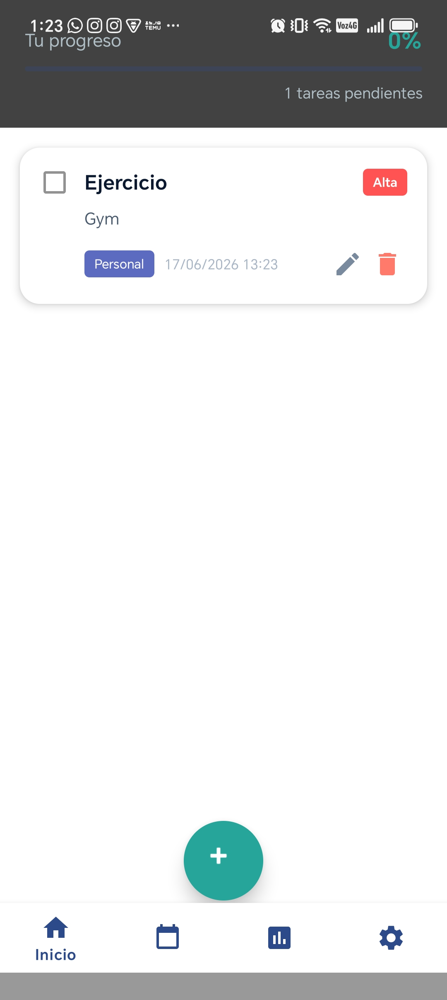
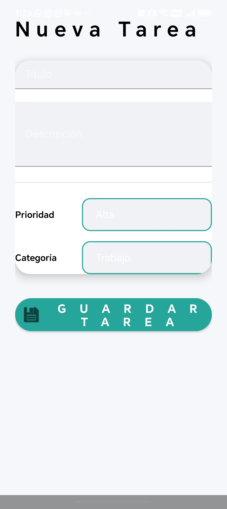
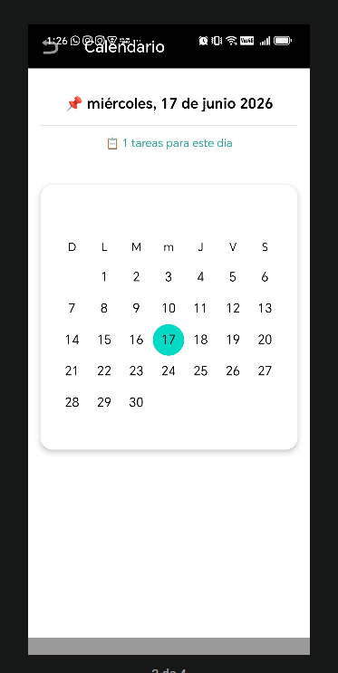
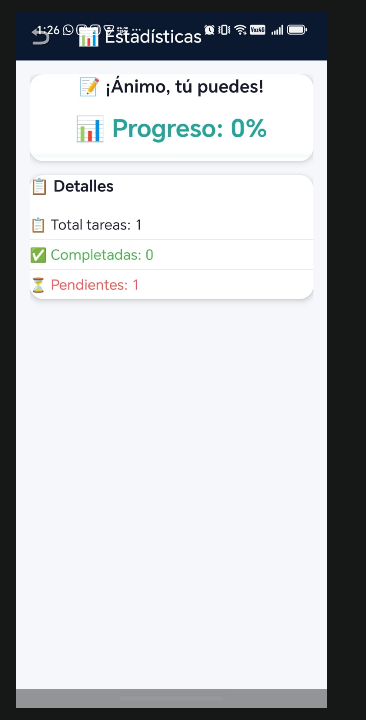
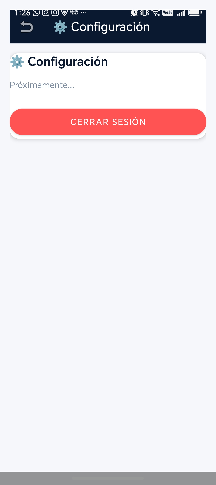
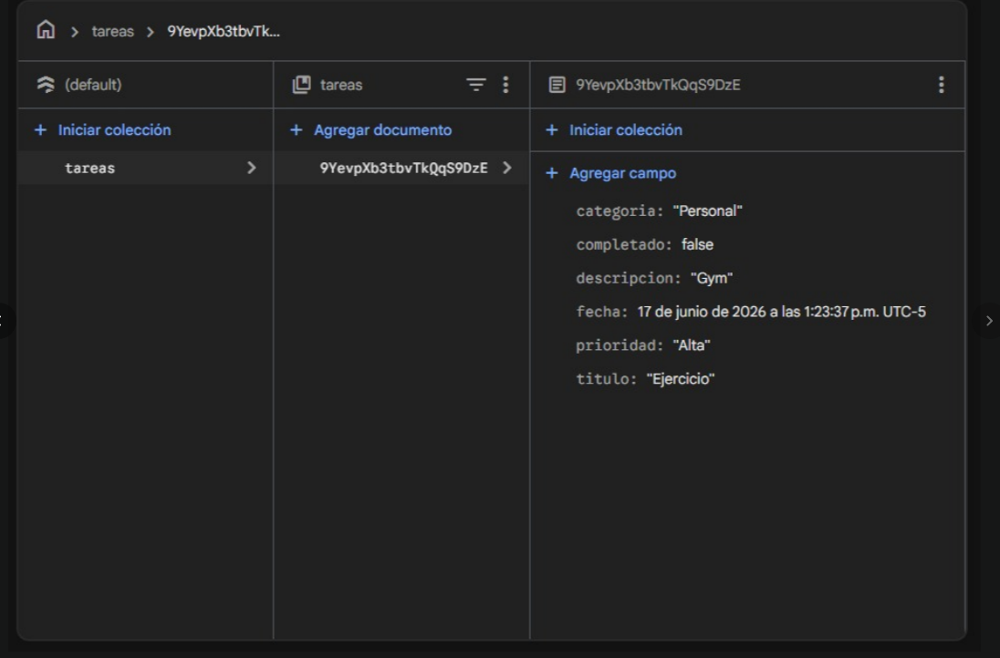

# 📋 To-Do List App

**Aplicación móvil nativa Android para gestión de tareas personales con autenticación, roles de usuario y sincronización en tiempo real usando Firebase.**

---

## 👤 Autor

**[Karen Tatiana Mendez]**
Programación de Aplicaciones Móviles II — Tercer Seguimiento (Sustentación Final)

---

## 📌 **Descripción del Proyecto**

Aplicación desarrollada en **Android (Java)** que permite a los usuarios registrarse, iniciar sesión y gestionar sus tareas diarias con **persistencia en la nube** mediante **Firebase Firestore** y **autenticación segura** con **Firebase Authentication**. La app implementa **control de acceso basado en roles (RBAC)**, distinguiendo entre usuarios **Administrador** y **Empleado**, cada uno con permisos distintos sobre el sistema.

---

## 🎯 **Características Principales**

### 🔐 **Autenticación y Seguridad**
- ✅ Registro e inicio de sesión con **Firebase Authentication**
- ✅ Contraseña oculta/visible con componente de Material Design (`password_toggle`)
- ✅ **Auto-Login**: si el usuario ya inició sesión, la app salta el Login al abrirse
- ✅ **Verificación de correo electrónico** al registrarse
- ✅ **Cerrar sesión** que destruye el caché local y el token de Firebase

### 👥 **Roles y Panel de Administración (RBAC)**
- ✅ Dos roles: **Administrador** y **Empleado**
- ✅ Los Empleados no ven el botón de eliminar tareas (`View.GONE`)
- ✅ Solo el Administrador ve y accede al **Panel de Control de Usuarios**
- ✅ Desde el panel, el Administrador puede **cambiar el rol** de un empleado o **eliminarlo** en tiempo real

### 📱 **Gestión de Tareas**
- ✅ **Crear tareas** con título, descripción, prioridad y categoría
- ✅ **Leer tareas** en tiempo real con `addSnapshotListener`
- ✅ **Actualizar tareas** (editar, marcar como completadas)
- ✅ **Eliminar tareas** con confirmación (solo Administrador)
- ✅ **Calendario** para ver tareas filtradas por fecha
- ✅ **Estadísticas** de productividad y distribución por prioridad

### 🎨 **Diseño UI/UX**
- ✅ **Material Design** con paleta de colores profesional (navy + menta)
- ✅ **CardViews** con sombras y bordes redondeados
- ✅ **Bottom Navigation** con 4 secciones, navegación por **Fragments** (sin recargar Activities)
- ✅ **FAB** flotante para agregar tareas
- ✅ **TextInputLayout** con `.setError()` en todos los formularios
- ✅ Validaciones de negocio en tiempo real (`TextWatcher`)
- ✅ Prevención de doble envío (botón deshabilitado mientras guarda)
- ✅ Responsivo: soporta rotación de pantalla (landscape)

### 🔧 **Tecnologías**
- **Firebase Authentication** — registro, login, sesiones
- **Firebase Firestore** — base de datos NoSQL en la nube, tiempo real
- **RecyclerView** con `ViewHolder` optimizado
- **Fragments** para navegación interna sin recrear Activities
- **Material Components** (TextInputLayout, MaterialCardView, MaterialButton)

---

## 📸 **Capturas de Pantalla**

| Login | Registro | Panel de Administración |
|-------|----------|--------------------------|
|  |  |  |

| Pantalla Principal | Agregar Tarea | Calendario |
|--------------------|---------------|------------|
|  |  |  |

| Estadísticas | Configuración | Firebase Console |
|--------------|---------------|-------------------|
|  |  |  |

---

## 🛠️ **Requisitos Técnicos Cumplidos (Momento 3)**

### ✅ **1. Módulo de Seguridad y Sesiones**
| Requisito | Implementación | Estado |
|-----------|-----------------|--------|
| Registro/Login | `AuthHelper` + `FirebaseAuth` | ✅ |
| Contraseña oculta/visible | `app:endIconMode="password_toggle"` | ✅ |
| Auto-Login | `SharedPreferences` + `getCurrentUser()` | ✅ |
| Cerrar sesión | `AuthHelper.cerrarSesion()` | ✅ |

### ✅ **2. Panel de Administración y Roles (RBAC)**
| Requisito | Implementación | Estado |
|-----------|-----------------|--------|
| Dos roles | `admin` / `empleado` en Firestore | ✅ |
| Ocultar funciones críticas a Empleado | `holder.btnEliminar.setVisibility(...)` | ✅ |
| Panel solo para Admin | `btnAdminPanel.setVisibility(...)` | ✅ |
| Cambiar rol / eliminar usuario | `UserAdminActivity` + `UsuarioAdapter` | ✅ |

### ✅ **3. Módulo Core (CRUD en Firestore + Tiempo Real)**
| Operación | Método | Estado |
|-----------|--------|--------|
| **Create** | `FirebaseHelper.agregarTarea()` | ✅ |
| **Read** | `FirebaseHelper.obtenerTareasEnTiempoReal()` | ✅ |
| **Update** | `FirebaseHelper.actualizarTarea()` | ✅ |
| **Delete** | `FirebaseHelper.eliminarTarea()` | ✅ |

### ✅ **4. Buenas Prácticas y UI/UX**
- ✅ Validaciones con `TextInputLayout.setError()`
- ✅ Responsividad: `ScrollView`/`NestedScrollView` en todos los formularios
- ✅ Código organizado en métodos separados (sin lógica en `onClick`)
- ✅ Liberación de memoria con `ListenerRegistration.remove()` en `onDestroy()`

---

## 📂 **Estructura del Proyecto**
